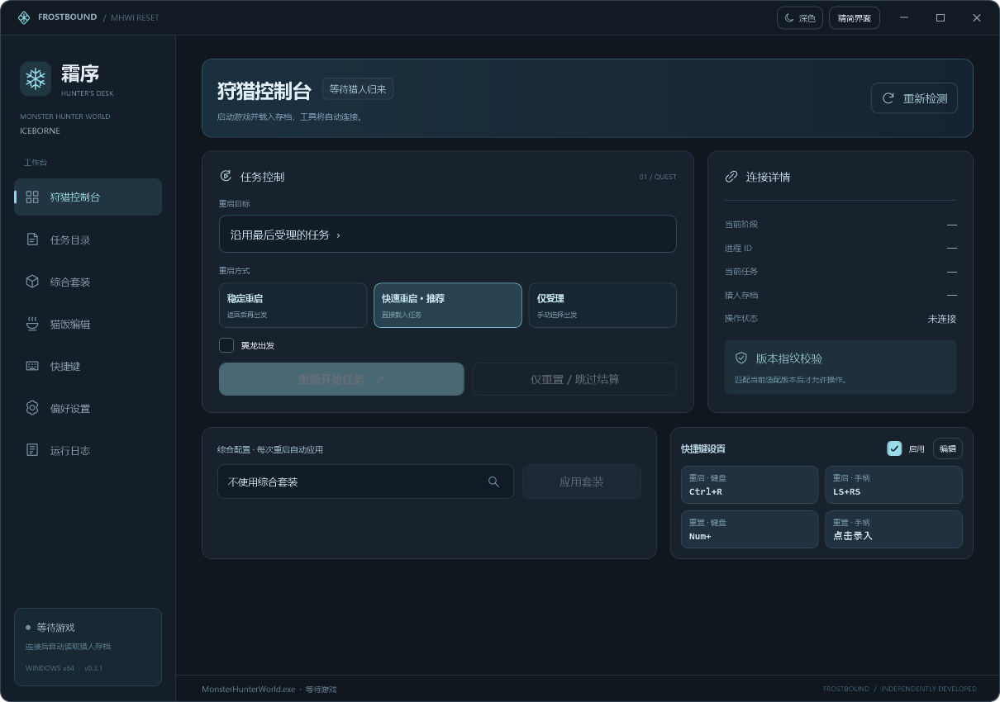
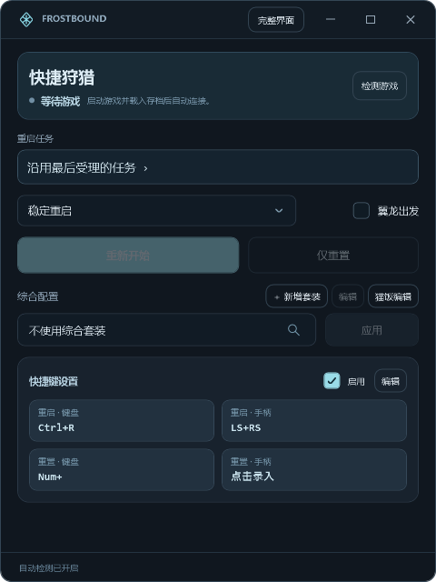
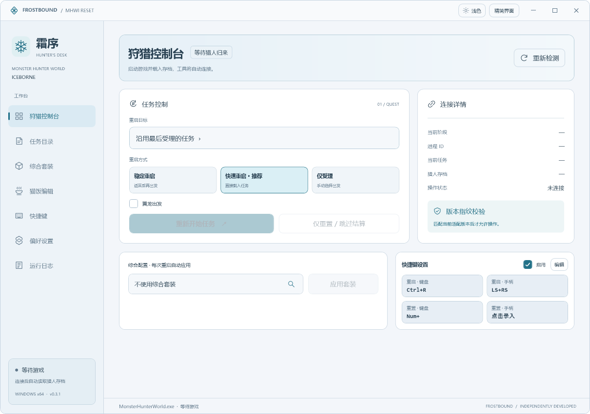
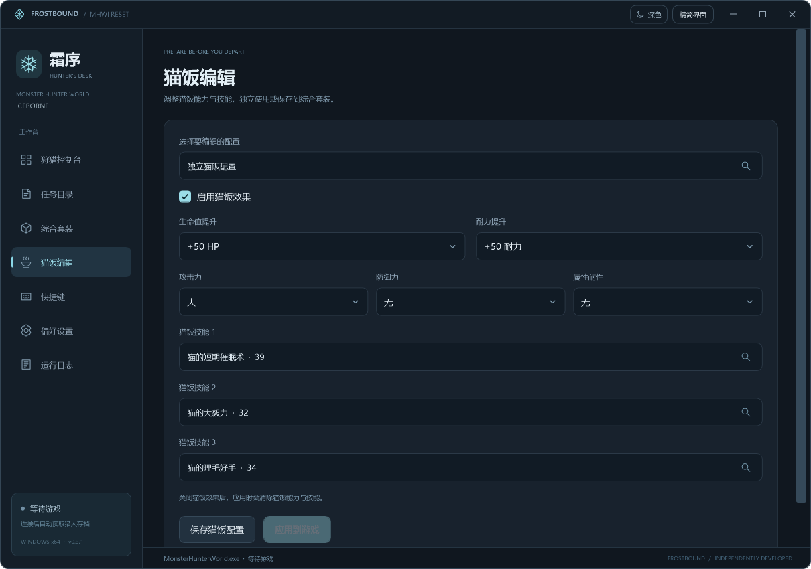

# 霜序 · Frostbound

使用 C#、WPF 和 Windows 进程 API 实现。界面、游戏连接检测、操作调度、任务控制、配置与日志均由本项目维护，专门面向 Windows x64。

在 [GitHub Releases](https://github.com/TheLostRiver/reset-tool/releases/latest) 下载 Windows 自包含程序或压缩包。



**精简界面**



**浅色界面**



## 当前状态

当前版本 `v0.3.1` 修正深色主题菜单的白色侧栏，并简化界面切换：窗口大小一次调整，保持左上角位置，内容仅作短淡入。已包含深色、浅色与跟随系统，修正道具套装编号换算导致应用下一条记录的问题。选中套装时，重启快捷键、重启按钮与“应用”使用同一套流程。新配置默认推荐快速重启，已有配置保留用户选择。

连接检测、版本匹配与猎人存档读取已确认，任务重启和套装应用已收到游戏内使用正常的反馈。本版道具编号修复通过游戏内存只读检查定位，更新后的写入和不同任务、道具及猫饭组合仍需继续实机确认。编译和界面预览不替代实际游戏操作确认。

游戏适配绑定到当前本地 Steam 正式版可执行文件的 SHA-256 指纹。遇到不同版本时会显示“版本不匹配”，并禁用游戏操作。

## 功能

| 功能 | 操作 |
| --- | --- |
| 两种界面 | 完整与精简模式可随时切换，保存上次选择 |
| 切换动画 | 窗口尺寸一次调整，内容仅作 120 毫秒轻微淡入，遵循 Windows 动画设置 |
| 颜色主题 | 深色、浅色、跟随 Windows 应用颜色；两种界面的顶部都可切换 |
| 游戏自动检测 | 启动软件后立即检测，每秒监测游戏启动、退出与存档载入 |
| 手动检测 | 控制台右上角点击“重新检测” |
| 连接状态 | 显示等待游戏、等待载入、已连接、权限不足和版本不匹配 |
| 稳定重启 | 正在任务中时先返回，再受理并出发 |
| 快速重启 | 默认推荐；直接准备并载入任务，力尽或特殊战斗阶段自动采用稳定流程 |
| 仅受理 | 在据点或探索中受理任务，手动选择出发 |
| 任务重置 | 返回当前任务；任务结束阶段跳过等待并进入结算 |
| 任务目录 | 512 条任务记录；按名称、编号和分类搜索，支持收藏、自定义名称和文本导入 |
| 翼龙起始 | 支持适用地图中的翼龙出发选项 |
| 综合套装 | 保存装备、道具、猫饭和任务组合，支持编辑、删除、应用与应用后出发 |
| 游戏内套装读取 | 读取当前猎人的装备与道具预设套装列表 |
| 存档绑定 | 套装可以绑定当前猎人存档与账户，应用前检查绑定 |
| 猫饭编辑 | 独立入口与套装内编辑；生命、耐力、攻击、防御、属性耐性，以及三个猫饭技能 |
| 搜索选择 | 任务、猫饭技能、综合配置及游戏内装备/道具预设可按名称与编号搜索 |
| 配置自动应用 | 选中配置后，重启按钮、快捷键与“应用”行为一致，使用套装保存的任务与配装、道具、猫饭 |
| 道具转盘 | 应用道具预设时，可遵循游戏设置、同步或保留当前转盘 |
| 键盘快捷键 | 两种主界面直接录入；两类动作各自保存和清除，支持手动编辑 |
| 手柄快捷键 | XInput 组合键；支持四个手柄，摇杆按下、肩键与扳机 |
| 聊天指令 | 使用任务名称或“任务名称，套装名称”执行组合操作 |
| 本地配置迁移 | 从本地目录读取旧配置、快捷键、任务名称与综合套装数据 |
| 配置备份 | JSON 导入、导出，保存时自动保留上次配置备份 |
| 三种界面语言 | 简体中文、English、日本語 |
| 通知区域 | 关闭窗口可继续在任务栏通知区域运行；菜单中可以退出 |
| 操作日志 | 按日期记录连接变化、操作开始、结果、超时与错误 |

装备记录应用后，角色外观会随下一次场景载入刷新。“应用并出发”会完成对应任务流程。未指定任务的套装可以只应用配置；指定任务的套装会受理该任务，并按所选模式决定出发方式。

## 界面切换

窗口顶部的“精简界面 / 完整界面”按钮可以即时切换，也可以在偏好设置中选择界面风格。切换后沿用同一个游戏连接、快捷键和配置，自动检测会继续工作。软件下次启动会恢复上次选择的界面。

完整界面的狩猎控制台将标题、游戏状态、连接说明和重新检测合并在同一张卡片中。默认窗口以及 `1000×740` 窗口可完整显示任务操作和综合配置区域，无需滚动。

精简界面使用独立的单页布局，不使用滚动容器。包含游戏检测、任务选择、重启方式、翼龙选项、重启/重置按钮、综合配置、套装新增与编辑、猫饭编辑，以及四个快捷键录入按钮。任务目录管理、日志与其他偏好设置通过完整界面访问。

## 颜色主题

两种界面的窗口顶部都提供主题选择按钮，可切换“深色”“浅色”“跟随系统”；完整界面的偏好设置也可以修改。主题选择保存在本地。跟随系统读取 Windows 的应用颜色，在系统设置改变后自动更新。

主题即时更新窗口、卡片、输入框、下拉列表、快捷键和编辑表单，不会重建正在编辑的表单。

## 快速重启

快速模式在普通任务中直接准备并载入任务，跳过返回据点的流程。稳定模式先返回据点，因此会出现任务重置提示并增加等待。新配置默认快速模式；已有配置保持原来的模式，需要时可手动切到“快速重启（推荐）”。实际耗时取决于游戏载入速度。

力尽、特殊战斗阶段或任务结算时，程序采用稳定处理。仅受理模式仍要求在据点或探索中操作。

## 快捷键录入

完整控制台右下方和精简界面底部都有“快捷键设置”。分别点击重启或重置的键盘／手柄绑定，按下需要使用的组合键即可录入并自动保存；手柄组合键在松开后确认。录入窗口可以“清除绑定”。重启与重置不能保存为相同的组合键。

点击录入区的“编辑”可以手动输入、清除并统一保存四个绑定，也可以调整“启用快捷键”和“只在游戏位于前台时触发”。完整界面左侧的“快捷键”页面提供相同的编辑功能。录入或手动编辑期间暂停快捷键触发。

## 任务、配装和猫饭组合

在“综合套装”中可以保存多套配置，每套都可以任意组合任务、装备预设、道具预设、猫饭能力与三个猫饭技能。

| 配置示例 | 任务 | 配装 | 猫饭 |
| --- | --- | --- | --- |
| 配置 A | 任务 A | 配装 A | 猫饭 A |
| 配置 B | 任务 B | 配装 B | 猫饭 B |
| 混合配置 | 任务 A | 配装 B | 猫饭 B |

选中配置后，点击“应用”、点击“重新开始”或按重启快捷键，都会执行同一个应用流程，使用套装保存的任务、配装、道具和猫饭。绑定任务的套装会按所选模式受理并出发；没有绑定任务时只应用配置。修改绑定任务请进入“编辑套装”。稳定模式先返回据点，再应用配置，避免返回流程覆盖刚应用的道具。

选中“不使用综合套装”时，重启按钮与重启快捷键执行普通任务重启，使用主界面的任务选择。“仅重置”用于返回/结算，不会自动出发。

## 猫饭编辑与搜索

完整界面左侧的“猫饭编辑”可编辑独立猫饭配置，也可选择某套综合配置并编辑其中的猫饭。精简界面的“猫饭编辑”按钮会直接打开当前所选套装的猫饭；未选择套装时编辑独立猫饭配置。

猫饭技能点击右侧放大镜即可搜索，支持中文、英文、日文名称以及技能编号。综合套装的绑定任务、装备/道具预设和主界面的综合配置选择也支持搜索。编辑后可以只保存，或在游戏就绪时点击“应用到游戏”。



## 使用

1. 打开 `Frostbound.exe`。
2. 启动游戏并载入猎人存档。软件会自动连接，也可以点击“重新检测”。
3. 在控制台选择任务，或沿用最后受理的任务。
4. 选择重启方式，然后使用界面按钮或快捷键。
5. 在“综合套装”中创建组合，使用“从当前猎人读取预设套装”取得实际编号与名称。
6. 在控制台或精简界面选中综合配置，之后重启就会自动应用整套配置。

从工具窗口执行任务操作时，默认会将游戏窗口切回前台，让游戏处理请求。可以在偏好设置中关闭此选项。

默认快捷键：

| 动作 | 键盘 | 手柄 |
| --- | --- | --- |
| 重启任务 | `Ctrl+R` | `LS+RS` |
| 重置任务 | `Num+` | 默认不绑定 |

`LS` / `RS` 为摇杆按下，`LT` / `RT` 为扳机。快捷键默认只在游戏位于前台时触发。PlayStation 手柄可通过 Steam Input 使用 XInput 兼容输入。

聊天指令在偏好设置中启用。例如：

```text
传说中的黑龙
传说中的黑龙，日常大剑
Fade to Black,My Greatsword
```

三种分隔符 `，`、`,`、`、` 均可使用。任务名称可以在任务目录中修改。旧任务名称文本使用 `任务ID:任务名称` 格式，任务 ID 前加 `1` 可标记翼龙起始，例如 `101606:自定义任务名`。

## Windows 构建

源码构建需要 **.NET 9 SDK** 和 Windows x64。打包后的自包含程序携带运行时，使用者无需单独安装 .NET。

```powershell
dotnet build Frostbound.csproj -c Release
.\build.ps1
```

输出：

```text
artifacts/
├── v0.3.1/win-x64/Frostbound.exe
├── Frostbound-v0.3.1-win-x64.zip
└── Frostbound-v0.3.1-SHA256.txt
```

只构建依赖本机 .NET Desktop Runtime 的较小版本：

```powershell
.\build.ps1 -FrameworkDependent
```

## 配置与日志

配置存放在 `%LocalAppData%\Frostbound\settings.json`，备份为 `settings.json.bak`。日志在同目录的 `logs` 文件夹。可以在偏好设置中直接打开目录。

个人配置、账户绑定、日志和构建产物不提交到 Git。仓库保留本项目源码、游戏任务目录、界面资产和使用文档。

## 实现结构

```text
Core/
├── GameEngine.cs      Windows 游戏连接、状态检查与任务/套装操作
├── ProcessMemory.cs   进程句柄与完整读写检查
├── Hotkeys.cs         键盘、XInput 与按下边沿检测
├── AppRuntime.cs      后台监测、聊天指令和界面事件
├── SettingsStore.cs   原子保存、恢复、导入导出与本地配置迁移
└── Models.cs          配置、任务、套装与参数校验
UI/
├── Elements.cs        通用界面元素与矢量图标
├── Dialogs.cs         任务选择、套装编辑与快捷键录制
├── SearchChoicePicker.cs  通用搜索选择窗口
├── FoodEditorControl.cs   共用猫饭表单与快捷编辑窗口
├── HotkeyEditorControl.cs 共用快捷键录入与设置表单
├── MainWindow.Compact.cs  界面切换与精简工作台
├── MainWindow.Hotkeys.cs  快捷键保存、冲突检查与录入
├── MainWindow.Transitions.cs  页面与窗口过渡动画
├── MainWindow.Theme.cs    主题选择与偏好设置
├── ThemeManager.cs       共享颜色与 Windows 主题监测
└── MainWindow.Food.cs     独立猫饭编辑页面
MainWindow.xaml       Windows 桌面窗口与导航
MainWindow.xaml.cs    完整工作台页面
```

游戏操作会串行执行，重复触发不会叠加。进程退出、读取失败、加载阶段和版本不一致会阻止继续操作。淡入淡出的临时修改在操作结束时恢复。程序操作运行中的游戏对象，不直接编辑游戏可执行文件或磁盘存档文件。

当前适配指纹：

```text
C2EBBBD2C49F216D484E31A5219BED419EB1E5E7D206D02CBA040A3AB79D90EA
```

更新游戏后，应重新研究并确认对应版本的状态与地址，再新增适配。
